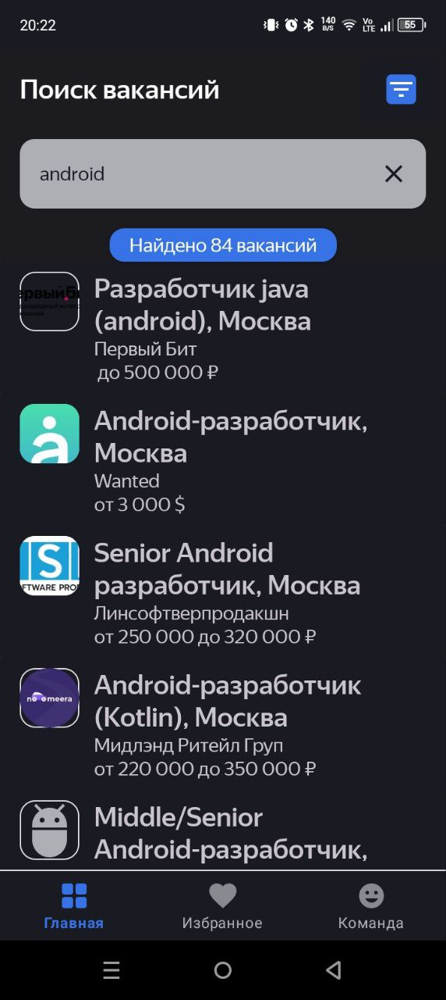
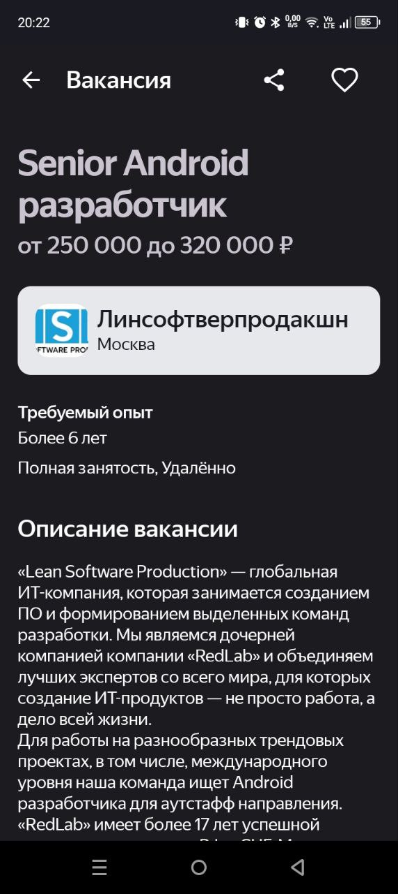

<h1 align="center">📱 MegaHH</h1>

Android-приложение для поиска работы с использованием HeadHunter API.

---

### 🧠 О проекте

MegaHH — Android-приложение для поиска вакансий с использованием HeadHunter API. Пользователь может искать вакансии, просматривать подробности, добавлять в избранное, настраивать фильтры поиска и делиться интересными предложениями. Настроена пагинация, расширены фильтры.

---

### 📸 Скриншоты

  
  
  

---

### ✨ Основной функционал

- Поиск вакансий по ключевым словам.
- Просмотр краткой и расширенной информации по каждой вакансии.
- Добавление вакансий в «Избранное».
- Настройка фильтров: регион, отрасль, уровень ЗП, скрытие без ЗП.
- Постраничная подгрузка результатов (paging).
- Поддержка оффлайн-доступа к избранным вакансиям.
- Сохранение логотипов работодателей на устройстве.
- Возможность открытия почты и звонков прямо из вакансии.
- Парсинг HTML-описания вакансии.
- Github Actions для CI: сборка и statical analysis с detekt.
  
---

### 🧭 Структура приложения

**Экраны:**
- Поиск вакансий
- Детали вакансии
- Избранные вакансии
- Фильтры поиска (регион, сфера, зарплата)

Каждый экран обрабатывает особые случаи: отсутствие данных, отсутствие интернета, 404 ошибки с сервера и т.д.

---

### 🧱 Технологии и стек

- **Язык**: Kotlin  
- **Архитектура**: MVVM  
- **Навигация**: SingleActivity + Fragments + BottomNavigation  
- **Сетевой стек**: Retrofit, Gson  
- **Хранение данных**: Room  
- **DI**: Koin  
- **Paging**: ручная реализация  
- **Статический анализ**: Detekt  
- **CI/CD**: GitHub Actions

---

### ⚙️ Установка

- Клонируйте репозиторий
- Откройте проект в Android Studio
- Синхронизируйте Gradle
- Запустите на Android 8+ (SDK 26)
